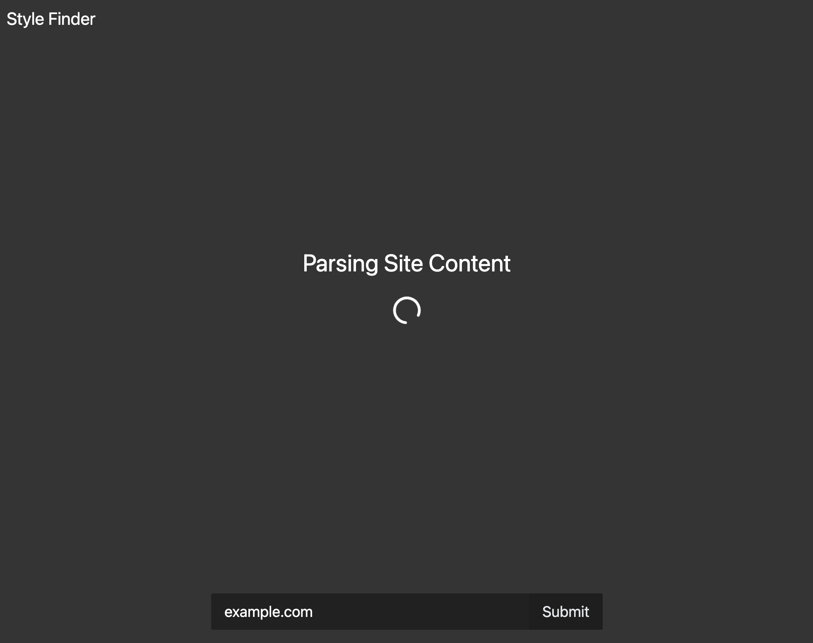
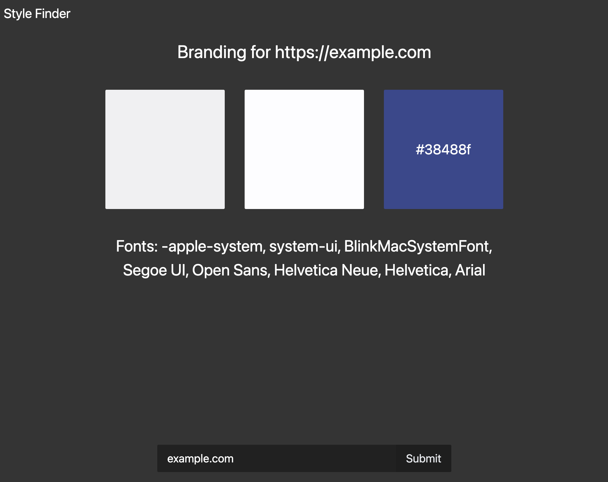

# Style Finder

Search a website for it's brand colors and fonts.

## Setup

### Step 1: Install Dependencies

#### Docker

`docker compose build`

**Note**: Ollama will pull a 2 GB llama3.2 model on build. Sometimes it will fail before downloading, just run the command again.

### Step 2: Run the Project

#### Docker

`docker compose up`

Open the live App by going to http://localhost:8000/

## Requirements

-   Recommended 8GB of Ram, though allocating only 6GB can work
-   Minimum 4 Core modern CPU or GPU with at least 12GB of VRAM, the more CPU allocated the faster you response time.
-   6.5GB of space if running on Docker. 3GB for Ollama and 2GB for llama 3.2B.
-   **If running on docker make sure to allocate these resources in resource settings**

## User Experience

The App starts at a page with an input box to enter a website URL.

After entering a URL the server will parse the website for data then feed it to Ollama to find the brand colors and fonts (this takes a couple minutes and by default will time out after 10 minutes).

After parsing the app will display the results with color previews.

